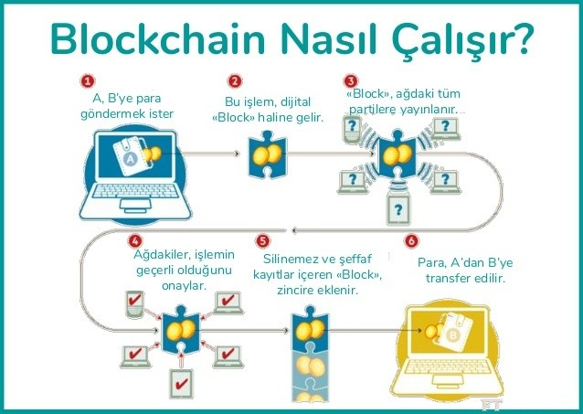

# Blockchain Nedir?

Blockchain, verilerin **merkezi olmayan (decentralized)** bir ağ üzerinde, **şifrelenmiş bloklar** halinde saklandığı, değiştirilemez (**immutable**) bir dijital kayıt teknolojisidir.  

En çok **Bitcoin** gibi kripto paralarla tanınsa da; finans, sağlık, tedarik zinciri, oylama sistemleri gibi pek çok alanda kullanılmaktadır.

---

## 📌 Temel Özellikleri

1. **Blok Yapısı**  
   - Veriler bloklar halinde saklanır.  
   - Her blok, bir önceki bloğun **hash** değerini içerir. Zincir (chain) bu şekilde oluşur.  
   - Eğer bir bloktaki veri değiştirilirse hash değeri değişir ve zincir bozulur.

2. **Blockchain’in Yapısı**
   - **Blok (Block)** → Veri, kendi hash’i ve önceki bloğun hash’ini içerir.  
   - **Hash** → Bloğun içeriğinin dijital imzası. Genellikle **SHA-256** ile üretilir.  
   - **Zincir (Chain)** → Blokların hash’lerle birbirine bağlanması.  
   - **Dağıtık Ağ (Distributed Network)** → Tüm veritabanı ağdaki her katılımcıda bulunur.

3. **Dağıtık Ağ (Distributed Network)**  
   - Veriler tek bir sunucuda değil, ağdaki **tüm düğümlerde (node)** tutulur.  
   - Tek bir noktaya saldırı tüm sistemi çökertemez.

4. **Kriptografi ile Güvenlik**  
   - Veriler **SHA-256** gibi algoritmalarla şifrelenir.  
   - Yetkisiz değişiklik yapılamaz.

5. **Değiştirilemezlik (Immutability)**  
   - Bir blok eklendikten sonra değiştirmek için **tüm ağın onayı** gerekir.  
   - Sahtecilik ihtimali minimuma iner.

---

## 🛠 Blockchain Nasıl Çalışır?

1. **İşlem Oluşturma** → Örn. Ali → Ayşe 2 BTC gönderir.  
2. **İşlem Ağa Yayılır** → Peer-to-peer ağ üzerinden tüm düğümlere iletilir.  
3. **İşlemin Doğrulanması** → Düğümler işlemi doğrular.  
4. **Blok Oluşturma** → Doğrulanan işlemler yeni bir blokta toplanır.  
5. **Blok Zincire Eklenir** → Önceki bloğun hash’i eklenerek zincire bağlanır.  
6. **Güncel Kopya Yayılır** → Güncellenmiş blockchain tüm düğümlere gönderilir.

---

## 📊 Basit Görsel Anlatım

Her blok bir önceki bloğun hash değerini içerir.  
Ortadaki bir bloğu değiştirirseniz, tüm zincir bozulur.

---

## 📌 Avantajları
- **Şeffaflık** → Herkes işlemleri görebilir.  
- **Güvenlik** → Kriptografi ile korunur.  
- **Merkeziyetsizlik** → Tek bir kontrol noktası yoktur.  
- **Değiştirilemezlik** → Veriler geriye dönük değiştirilemez.

---

## ⚠️ Dezavantajları
- **Enerji Tüketimi** → PoW sistemlerinde yüksek enerji kullanımı.  
- **İşlem Hızı** → Bazı blockchain ağlarında işlemler yavaş olabilir.  
- **Depolama Sorunu** → Zincir büyüdükçe veri boyutu artar.

---

## 📍 Kullanım Alanları
- Kripto paralar (Bitcoin, Ethereum)  
- Akıllı sözleşmeler (Smart Contracts)  
- Tedarik zinciri yönetimi  
- Oylama sistemleri  
- Dijital kimlik  
- Veri güvenliği ve arşivleme  

---

> Blockchain, “herkesin görebildiği ama kimsenin silemediği bir defter” gibidir.  
> İşlemler kronolojik olarak eklenir, şifrelenir ve tüm ağda saklanır.
