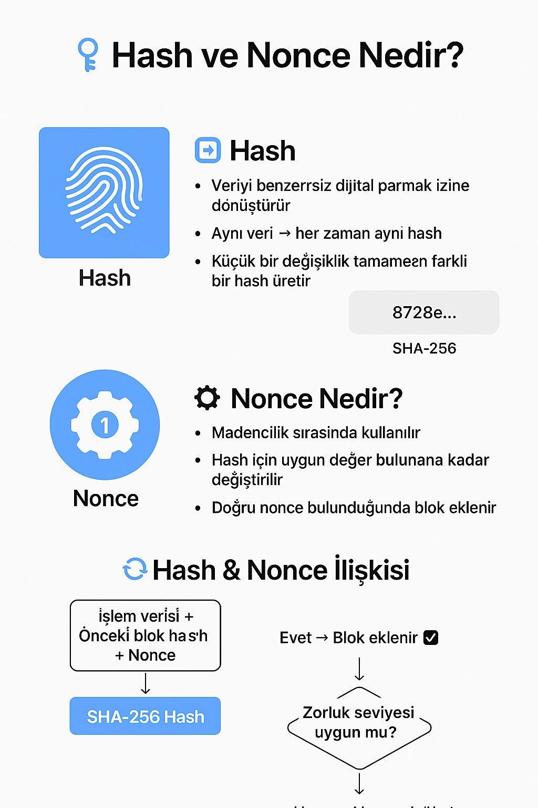

# Hash ve Nonce Nedir?

Blockchain'in temelini oluşturan iki önemli kavram: **Hash** ve **Nonce**.  
Bu ikisi, blokların güvenliğini ve zincirin bütünlüğünü sağlar.

---

## 🧩 Hash Nedir?

**Hash**, herhangi bir veriyi (metin, dosya, işlem verisi vb.) belirli uzunlukta, benzersiz bir **dijital parmak izine** dönüştüren bir şifreleme işlemidir.

- Blockchain’de genellikle **SHA-256** algoritması kullanılır.
- Aynı veri **her zaman aynı hash** değerini üretir.
- Veride **küçücük bir değişiklik** bile tamamen farklı bir hash değeri oluşturur.

### 🔹 Örnek
Metin: Merhaba Dünya
SHA-256 Hash: 872e4bdc72b3edc29c80d7c9c3d47ff9d9c3c8ad5d7a...
Metin: merhaba dünya
SHA-256 Hash: 0573a10888b83a1e8cfdc356edcd3af2a...

> Küçük/büyük harf değişikliği bile hash’i tamamen değiştirir.

---

## ⚙️ Nonce Nedir?

**Nonce** ("number used once" – bir kez kullanılan sayı) blockchain’de **madencilik (mining)** sırasında kullanılan özel bir sayıdır.

- Amacı, blok hash’ini **istenen zorluk seviyesine (difficulty)** uydurmaktır.
- Madenciler, hash belirli sayıda sıfırla başlasın diye **nonce değerini sürekli değiştirerek** yeniden hash hesaplar.
- Doğru nonce bulunduğunda blok zincire eklenir.

---

## 🔄 Hash & Nonce İlişkisi

1. Blok verileri (işlemler, önceki blok hash’i vb.) + nonce birleştirilir.
2. Bu birleşim SHA-256 ile şifrelenir.
3. Eğer hash istenen zorlukta değilse, nonce değiştirilip tekrar denenir.
4. Doğru nonce bulunduğunda blok onaylanır.

---

## 📊 Görsel Anlatım

---

## 🎯 Özet
- **Hash** → Verinin benzersiz dijital parmak izi.
- **Nonce** → İstenen hash’i elde etmek için kullanılan, her denemede değişen sayı.
- **Birlikte** → Blockchain güvenliği ve madencilik sürecinin temelini oluştururlar.

---

