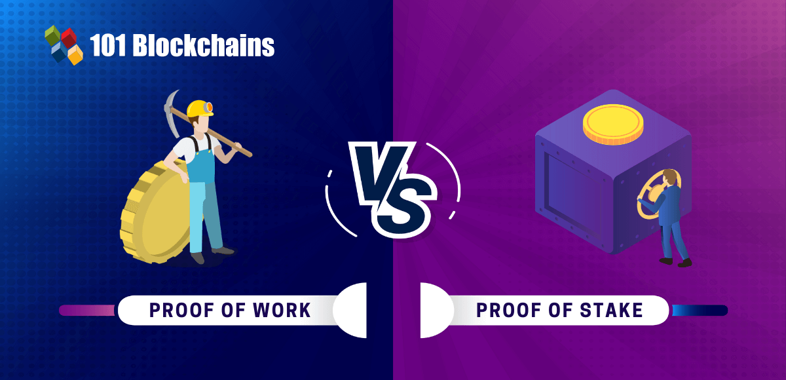

# PoW ve PoS Karşılaştırması

Blockchain dünyasında blokların eklenmesi için kullanılan iki popüler konsensüs mekanizması vardır: **Proof of Work (PoW)** ve **Proof of Stake (PoS)**.  
Her ikisi de ağın güvenliğini sağlar, ancak çalışma mantıkları ve kaynak kullanımları farklıdır.

---

## ⚡ Proof of Work (PoW) Nedir?

**PoW**, Bitcoin ile popülerleşmiş bir doğrulama yöntemidir.  
Madenciler, belirli zorlukta bir hash üretmek için **nonce** değerini değiştirerek çok sayıda işlem yapar.

- **Avantajları**:
  - Güvenliği yüksek (ağ saldırıya karşı dayanıklı)
  - Uzun süredir kullanılan ve test edilmiş sistem

- **Dezavantajları**:
  - Yüksek enerji tüketimi
  - Madencilik cihazları (ASIC, GPU) gerektirir

**Örnek Kullanım:** Bitcoin, Litecoin

---

## 🌱 Proof of Stake (PoS) Nedir?

**PoS**, blok üretme hakkını madencilik gücüne değil, sahip olunan coin miktarına göre verir.  
Blok doğrulayıcıları (validator), stake ettikleri (kilitledikleri) coin’ler ile seçilir.

- **Avantajları**:
  - Çok düşük enerji tüketimi
  - Özel madencilik donanımı gerekmez

- **Dezavantajları**:
  - "Zengin daha zengin olur" riski
  - Daha yeni bir teknoloji, PoW kadar uzun süredir test edilmedi

**Örnek Kullanım:** Ethereum (Merge sonrası), Cardano, Solana

---

## 🔄 PoW vs PoS Karşılaştırma Tablosu

| Özellik       | PoW | PoS |
|---------------|-----|-----|
| Enerji Tüketimi | Yüksek | Düşük |
| Donanım Gereksinimi | Yüksek | Düşük |
| Güvenlik       | Çok yüksek (fiziksel maliyet) | Yüksek (finansal maliyet) |
| Hız           | Daha yavaş | Daha hızlı |
| Örnek Ağlar   | Bitcoin, Litecoin | Ethereum, Cardano |

---

## 📊 Görsel Anlatım

---

## 🎯 Özet
- **PoW** → İşlem gücü ile blok doğrulama (enerji yoğun)
- **PoS** → Stake edilen coin miktarına göre blok doğrulama (enerji verimli)
- İki mekanizma da blockchain güvenliği için kullanılır, ancak farklı ihtiyaçlara göre tercih edilir.

---

## 📚 Kaynaklar
- [Proof of Work](https://en.wikipedia.org/wiki/Proof_of_work)
- [Proof of Stake](https://en.wikipedia.org/wiki/Proof_of_stake)
